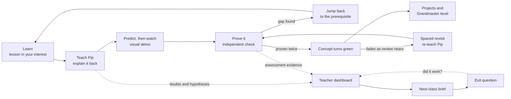

# Protégé: Ideation

**Theme:** Reinventing Education with AI

> **Most AI tutors do the thinking for the student. Protégé reverses that: the student teaches the AI, and every gap that shows up in that conversation becomes a specific action for the teacher.**

**TL;DR**

- Students learn a concept through examples drawn from something they care about (football, space, drawing, music). Then they **teach it to Pip**, an AI companion that keeps asking "why?" until the gaps show.
- Protégé **finds the real gap**, which is often an earlier prerequisite, and sends the student back to fix it on their **personal concept map**. A concept turns **green only after an independent, hint-free check proves it**, and it fades back to yellow when a review is due.
- Teachers get something a gradebook can't give them: **what most of the class misunderstands, how many students are affected, the evidence, and a ready next-class plan.** An exit question then shows whether the reteach worked.
- **AI proposes, code decides.** AI explains, converses and interprets. Scores, mastery and class statistics come from reviewed content and deterministic logic.

---

## 1. The problem

The problem statement asks what changes for students, for teachers, and for how learning is measured. Today all three fail at the same point: **a student's confusion rarely turns into a specific, timely teaching action.**

| | What happens today | Why it matters |
|---|---|---|
| **Students** | The whole room moves at one pace. A student stuck on recursion is often stuck on how functions *return values*, which was two chapters back. Students hesitate to ask in class, and a general-purpose chatbot will just hand them the answer. | Recognising an explanation feels like understanding it. AI that gives out answers can raise practice scores while lowering performance without help (Bastani et al., 2024). |
| **Teachers** | Teachers see marks and finished assignments, not the reasoning behind them. Nobody can read 40 private tutoring chats. | They reteach the wrong thing, or the right thing to the wrong students. |
| **Measurement** | One big exam at the end. "Completed" is treated as if it meant "understood." | Gaps surface too late to fix, and nobody checks whether students still remember a topic. |

## 2. The idea: one closed loop for learning and teaching

Each student moves through the loop at their own pace. The evidence the loop produces then becomes the teacher's view of the whole class. The teacher acts on it in the classroom, and the exit question closes the loop by checking whether that action helped.

---

## 3. Meet Pip, the companion the student teaches

**Pip is an AI companion who doesn't know the concept yet and wants the student to teach it.** Pip is curious and a little stubborn, and keeps asking good questions. The idea comes from research on *teachable agents* and the *protégé effect*: students put more effort into learning when they are responsible for teaching someone else (Chase et al., 2009). Explaining also exposes gaps that rereading hides.

**How Pip works**

- **One question per turn.** Pip asks the student to explain, justify, give an example or handle an edge case: *"Why does that call return first?"* *"What happens when the input is zero?"*
- **Pip's notebook.** Pip writes down what it has been taught. The student watches the notebook fill up: *base case ✓, recursive step ✓, moving toward the base case ✗*. The missing pieces are visible to the student.
- **Spot Pip's mistake.** Sometimes Pip confidently states a well-known misconception: *"So when we hit the base case, that's the final answer and everything stops, right?"* A student who agrees has revealed the misconception. A student who corrects Pip has shown real understanding. This turns the misconception catalogue from a passive list into active probes.
- **Tone and difficulty dial.** The student picks Pip's personality: **curious beginner**, **skeptical friend** or **tough interviewer**. Separately, they pick how deep Pip probes, from Level 1 to Level 3. Tone changes *how Pip talks*, difficulty changes *what Pip asks*, and **neither one changes the grading standard.**
- **Pip never gives the answer.** If a student asks Pip to do their homework, Pip says *"Hey, I'm the one learning here!"* and offers Learn mode instead.
- **Pip remembers.** Days later, during a spaced review, Pip comes back with a question about what the student taught it, which makes a quick two-minute re-teach.
- **Pip can't award mastery.** A fluent conversation is evidence worth looking at, not proof. Only independent checks turn a concept green.

**What a turn looks like** (a student who picked *football*, learning recursion):

> **Riya:** Recursion is like a knockout tournament. To find the champion, you find the winners of each half of the bracket.
> **Pip** *(skeptical friend)*: Okay, but when does it stop? Do we keep splitting forever?
> **Riya:** It stops when a bracket has just one team. That team is the winner of its bracket.
> **Pip:** Oh, so that's the base case! *(notebook: base case ✓)* What would happen if we forgot it?

**What Pip means for teachers.** Pip lets the teacher see into dozens of private explanations without reading any of them. Whatever a student struggles to explain becomes structured evidence on the dashboard: which concept, which misconception, and a short supporting quote. Private doubts are anonymised by default, so students still feel safe asking.

---

## 4. The student journey

*Example: Riya, Class 10, picks football. The chapter is Recursion, with 8 connected concepts.*

### 4.1 Sign-up: interest profile and entry path
At sign-up the student picks what they like (**space, drawing, football, music**). They also choose a path: **"I'm new"** starts with a lesson, not a quiz, so a complete beginner is never stuck. **"Check what I know"** starts with a short diagnostic, so students who already know the material can skip ahead.

### 4.2 Learn mode with interest-based explanations
The tutor introduces the concept, walks through a worked example and asks one small guided question. Explanations use the student's interest as a lens:

| Interest | How recursion is explained |
|---|---|
| **Space** | A rocket's staged countdown: each stage fires, then hands off to a smaller stage until liftoff. |
| **Drawing** | A fractal tree: each branch draws two smaller branches until they get too small to draw. |
| **Football** | A knockout bracket: the champion is the winner of two half-brackets, all the way down to a single team. |
| **Music** | A cumulative song: each verse adds a line, then the song unwinds back through every earlier line, the same way calls return. |

Two safeguards keep the analogies honest:
- Every interest lesson ends with **"Where this analogy breaks"**, for example: *"In a real tournament, matches run at the same time. In recursion, each call waits for the one below it to finish."* Knowing the limits of an analogy is itself part of understanding.
- If an analogy would mislead, the student gets a plain explanation instead. *Explain differently* is always one tap away.

The interest is not just a word added to a prompt. It carries through Pip's examples, the prediction activity, review questions and projects.

### 4.3 Teach Pip
The student explains the concept to Pip, as described in Section 3. When Pip's notebook is full, Pip says *"I think I get it! Can you prove it?"* and the student moves on to an independent check.

### 4.4 Predict, then watch
Before the visualiser runs `countdown(3)`, Riya predicts the output order. The animation then shows each call stacking up and returning. **The first step where her prediction differs is highlighted**, and she rewrites her rule. Memorised rules don't survive this test, but understanding does.

### 4.5 Prove it: independent checks, confidence and levels
- Fresh questions with **no hints, no Pip and no tutor.** Answer keys stay on the server and are scored by code.
- Before submitting, the student taps how sure they are: **sure / think so / guessing.** A *confidently wrong* answer points to a misconception, not just a gap, and it is the most useful signal for the teacher. Correcting a high-confidence error also tends to stick better (Butterfield & Metcalfe, 2001).
- A concept turns **green** only after **two correct answers from different question families.** An answer that used a hint doesn't count.
- Revision runs through levels: **Level 1 Basic → Level 2 Application → Level 3 Challenge → Grandmaster.** The Grandmaster level is a debugging or edge-case task defended against tough-interviewer Pip. Passing it earns a **Grandmaster badge** and a spot on the class Grandmaster wall, with an optional prize that the teacher defines.

### 4.6 Find the real gap and jump back
- **Diagnose the first wrong step.** For code traces, Protégé finds the exact step where the student's reasoning went off. For written answers, the AI picks the likely misconception from a **reviewed catalogue**, quotes the evidence and asks a targeted follow-up when unsure. AI diagnoses are treated as hypotheses, never verdicts.
- **Personal concept map.** Everyone shares the same curriculum map, but each student's nodes show their own state: **not checked (grey), learning (blue), needs practice (orange), demonstrated (green), review due (yellow).** Clicking a node opens its lesson and the evidence behind its colour.
- **Jump back to a prerequisite.** If Riya keeps failing recursion, Protégé doesn't make her redo the whole chapter, and it doesn't assume everything is weak. It tests the most likely prerequisite first (for example, return values) with a two-question check. If she's weak there, she gets targeted revision and then **returns exactly where she left off.** If she passes, it digs into the current concept instead.

### 4.7 Keep it: spaced revisits and streaks
- **Green slowly fades.** Following the Ebbinghaus forgetting curve and research on spaced practice, a green node fades a little each day and turns **yellow** when a review is due (after 1, 3, 7, 14 and then 30 days). A quick review or a re-teach to Pip makes it green again. The map says *"review due"*. It never claims the student has forgotten.
- **Streaks count learning, not logins.** A day counts only if the student completed a scored activity, no matter how many submissions they made.

### 4.8 Use it: Explore projects
When the required concepts are green, a small project unlocks in the student's interest area. Drawing gets a **fractal tree generator**, football a **knockout bracket builder**, space a **staged rocket flight** and music a **recursive rhythm pattern**. The concept map gives the AI a real reason to suggest each project: *"You've proven base cases and the call stack, so you're ready for this."*

---

## 5. What changes for teachers

### 5.1 Student doubts reach the dashboard
Students can ask the AI any doubt in private. When a doubt is relevant, the AI turns it into a short **learning observation**: the concept, the possible difficulty, a supporting phrase and the type of evidence. It is **anonymised by default**, so students who would never raise a hand still get heard. A message with several doubts becomes several observations. Off-topic chat is ignored.

### 5.2 What most students struggle with
The teacher sees **ranked difficulty cards** with counts they can trust:

> **"The base case is the final answer": 9 of 24 assessed students (6 were confident), 7 not yet assessed, 2 recovered after revision.** *Open evidence ▸*

- Counts are of **distinct students**, not messages or attempts. The numbers come from the database, and the AI only names and explains the pattern.
- **Class heatmap:** the same concept map, coloured by how much of the class has demonstrated each node. It shows where the class gets stuck.
- **Three kinds of evidence are kept separate:** what students *said*, what the AI *suspects*, and what checks *proved*. Chat alone never counts as proof of weakness.

### 5.3 The next-class brief
With one click, the teacher gets a half-page plan:

> **Next class: Recursion (Class 10-B, 24 of 31 assessed)**
> 1. **"The base case is the final answer"** (9 students). *Action:* trace `factorial(3)` on the board with a call stack of sticky notes and ask "Who does `factorial(1)` return *to*?"
> 2. **"No progress toward the base case"** (5 students). *Action:* show the countdown that never ends and fix it together.
> 3. **"Prints after the call run before it"** (4 students). *Action:* use the music-verse unwinding example.
> **Exit question:** "What does `mystery(3)` print?" *(from the reviewed question bank)*

The brief uses **only approved examples and questions** and cites real evidence. If there isn't enough data yet, it says so instead of guessing.

### 5.4 Did it work?
The teacher assigns the exit question. Protégé compares **before and after only for students who completed both**, and lists students who haven't answered separately. The AI summarises the result and suggests a next step. It is not allowed to claim that the lesson *caused* any change.

### 5.5 The catalogue learns from real classrooms
Doubts that don't match any known misconception are grouped together and **proposed to the teacher as new catalogue entries.** The catalogue grows from what real students struggle with, and a human approves every addition.

---

## 6. How learning gets measured

Protégé treats evidence as a ladder. Only the top steps can change a student's mastery.

| Signal | Example | What it can do |
|---|---|---|
| Student-reported doubt | "I don't get why it returns 1." | Appears on the teacher's feed, anonymised |
| AI hypothesis | Pip suspects Riya thinks the base case is the final answer | Triggers a targeted check, never changes mastery |
| Probe response | Riya agreed with Pip's planted mistake | Stronger hypothesis that triggers a check |
| **Independent check** | Code-scored, hint-free answer to a fresh question | **The only signal that changes mastery** |
| **Retention check** | Correct again after 7 days | Keeps the concept green |

Protégé also measures the teaching itself: exit-question results show whether the reteach helped. If we pilot it, we'll track gains on fresh unassisted questions, 7-day retention, recovery after jump-back revision, and teacher prep time saved per lesson.

## 7. Where AI is used, and where it deliberately isn't

| AI does | Code and reviewed content do |
|---|---|
| Interest-based explanations and "explain differently" | The concepts, prerequisite links, questions and answer keys |
| Pip's conversation, notebook and planted mistakes | Scoring every independent check |
| Suggesting the likely misconception (from a fixed catalogue) | Mastery states, concept-map colours, review dates and streaks |
| Explaining why a prediction was wrong (from a verified trace) | Choosing which prerequisite to check |
| Turning doubts into teacher observations | Counting affected students and class statistics |
| Writing the next-class brief and the follow-up summary | Unlocking projects and checking Grandmaster eligibility |

The AI can't write a mark, award mastery or invent a statistic. As a result, an AI mistake costs a confusing sentence at worst, never a wrong grade.

## 8. What sets Protégé apart

1. **The student teaches and the AI learns.** Most AI tutors let students stay passive. Pip makes them do the thinking, and planted mistakes test whether they really understand.
2. **Proven mastery.** A concept turns green only after two hint-free checks from different question families, so it can't be gamed by pasting answers from a chatbot.
3. **Finds the root cause, not just the symptom.** Diagnosis, a prerequisite check and a return to the original task: targeted revision instead of rereading the whole chapter.
4. **Your interests run through everything.** The same interest shapes lessons, Pip's examples, predictions, reviews and projects, and every analogy states where it breaks.
5. **Confidence matters.** Separating "confidently wrong" from "unsure but right" tells teachers which problems are misconceptions and which are gaps.
6. **Teachers get an action, not a percentage.** Instead of "class mastery 62%", they get "9 students believe X, here's the evidence, here's what to do tomorrow, and here's how to check it worked."
7. **Safe to ask.** Private doubts reach the teacher anonymously, so quiet students are counted.
8. **Built to be trusted.** AI output is checked against reviewed content, and every number a teacher sees is computed, never generated.

## 9. Scope

| | What's included |
|---|---|
| **Prototype: the full loop, done properly** | One programming chapter (Recursion, 8 concepts): interest-based Learn mode, Teach Pip, prediction vs. execution, independent checks with confidence, concept map with jump-back, teacher difficulty cards, next-class brief, exit question follow-up |
| **Prototype: light versions** | Pip's persona dial, levels and Grandmaster badge, streaks, spaced-review fading, one polished interest project (fractal tree) |
| **Future work** | Voice teaching with Pip, a code sandbox, uploading any course material, regional-language support, deeper gamification. Each is valuable but costs hours. The architecture leaves room for all of them: content is data, the AI layer is swappable, and the model already handles many languages. |

## 10. Research basis

- Chase, Chin, Oppezzo & Schwartz (2009). *Teachable agents and the protégé effect.* J. Science Education & Technology, 18(4). The basis for Teach Pip.
- Biswas et al. (2005). *Learning by teaching: a new agent paradigm for educational software* (Betty's Brain). Applied AI, 19(3–4).
- Bastani et al. (2024). [*Generative AI can harm learning.*](https://hamsabastani.github.io/education_llm.pdf) Why independent checks are required.
- Dunlosky et al. (2013). [*Improving students' learning with effective learning techniques.*](https://www.psychologicalscience.org/publications/journals/pspi/learning-techniques.html) PSPI, 14(1). Practice testing and spaced practice.
- Cepeda et al. (2006). *Distributed practice in verbal recall tasks.* Psychological Bulletin, 132(3). Ebbinghaus (1885): the forgetting curve.
- White & Gunstone (1992). *Probing Understanding* (Predict–Observe–Explain). The basis for prediction vs. execution.
- Butterfield & Metcalfe (2001). *Errors committed with high confidence are hypercorrected.* JEP: LMC, 27(6). Confidence checks.
- Adams, McLaren et al. (2014). *Using erroneous examples to improve mathematics learning.* Computers in Human Behavior, 36. Spot Pip's mistake.
- Walkington (2013). *Personalising instruction to student interests.* J. Educational Psychology, 105(4). Interest-based explanations.

*This research supports the design. Our specific implementation still needs to be tested with real students, and the evaluation plan in Section 6 is how we would do it.*

➡️ **How all of this is built, and how Cline builds it: [TECHNICAL_DOCUMENTATION.md](./TECHNICAL_DOCUMENTATION.md)**
